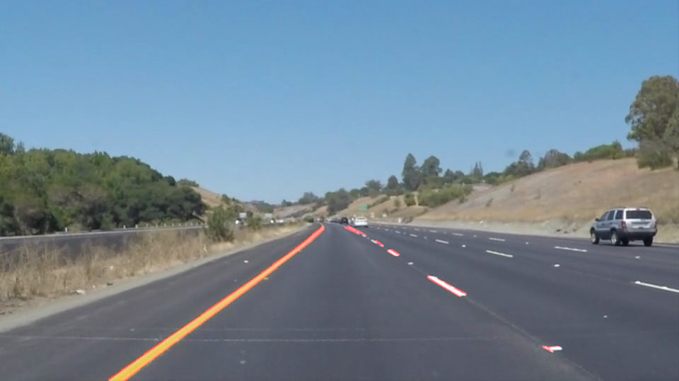
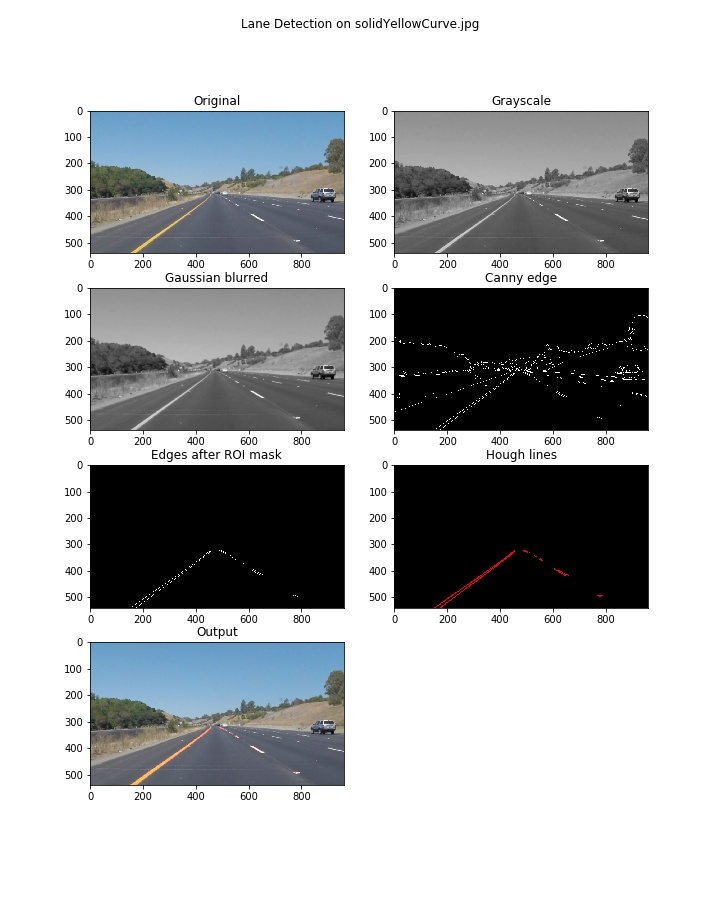
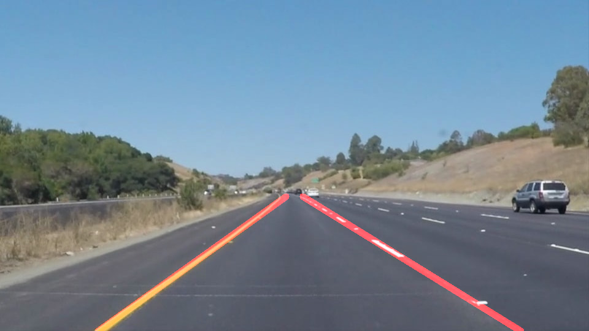

# **Finding Lane Lines on the Road** 

Overview
---

When we drive, we use our eyes to decide where to go.  The lines on the road that show us where the lanes are act as our constant reference for where to steer the vehicle.  Naturally, one of the first things we would like to do in developing a self-driving car is to automatically detect lane lines using an algorithm. The goal of this project is to identify lane lines on the road from a set of images and videos.

Reflection
---

### 1. Pipeline Description

The pipeline for lane detection performs the following steps:

1. Convert input image to grayscale.
2. Apply [Gaussian blurring](https://docs.opencv.org/3.0-beta/doc/tutorials/imgproc/gausian_median_blur_bilateral_filter/gausian_median_blur_bilateral_filter.html?highlight=gaussian%20smoothing) to reduce noise.
3. Perform [Canny edge detection](https://docs.opencv.org/3.0-beta/doc/py_tutorials/py_imgproc/py_canny/py_canny.html?highlight=canny%20edge).
4. Apply a mask to obtain edges within the region of interest.
5. Perform [Hough transform](https://docs.opencv.org/3.0-beta/doc/py_tutorials/py_imgproc/py_houghlines/py_houghlines.html) to identify lines within the edge image.
6. Overlay the Hough lines onto the original image. 

The algorithms in the steps above are OpenCV implementations.

The following is a sample output image from the pipeline.

The following figure illustrates the intermediate steps of the pipeline.

The 'draw_lines' function was improved to do lane extrapolation as follows:

1. Filter the the Hough lines obtained from the pipeline by slope. The assumption made here is that lines that are not 'steep' are most likely not part of the left or the right lanes. 'Non-steep' lines are rejected in this step.

2. Classify the remaining lines as part of the left lane or the right lane, using the slope values.

3. On each set of lines, apply linear regression on the collection of their endpoints to obtain a line parameters that best fits those endpoints.

4. Using the line parameters, extrapolate the lane positions and draw them onto the image.  

Inspiration for the linear regression step was gained from [Nicholas Andre's blog post](https://blog.nicholasandre.com.br/2017/12/22/finding-lane-lines-with-computer-vision/), in which the code in `extrapolate_lanes` function is based on. 

The following is an improved output image from the pipeline.

### 2. Potential Shortcomings

##### Detection on Curved Lanes

While the pipeline works fairly well on the test examples, most of these are cases in which the road is straight for the most part. This pipeline would not (yet) work well on images in which the lanes are curved - the Hough transform and linear regression steps would not be as effective due to the curvature in the lanes. This shortcoming is demonstrated in the video for the challenge item. 

##### Detection on Different-colored Surfaces

This is another weakness illustrated by the challenge video. Lane detection does not perform well when the car passes over the light-gray segment of the road, in contrast to the rest of the road segments which are dark. It is most likely the case that the pipeline cannot detect the yellow and white lane lines because the gradient between those colors and the light-gray road segment is not large enough to be detected by Canny edge algorithm. 

##### Parameter Tuning

It was not a large issue during this project, but it may be the case that different lighting conditions can affect performance - pictures taken during the night may require a different set of parameters for Canny and Hough. A "one-size-fits-all" type of solution may not be possible. 

### 3. Possible Improvements

##### Curved Lanes - Use Second-order Polynomial Fitting

The pipeline extrapolated a line based on the line parameters from linear regression. Thus it doesn't perform well on curved lanes. The regression was done using [np.polyfit](https://docs.scipy.org/doc/numpy/reference/generated/numpy.polyfit.html) which can support higher-order polynomial fitting. A second-order polynomial fitting may be helpful in extrapolating a curved line. However, drawing the curved markers onto the image may be less simple compared to drawing a line.

##### Diferent-colored Surfaces - Try Different Color Spaces

The shortcoming of the model was that the yellow and white lanes were difficult to detect when the road background was light-gray. Other color spaces, such as [HSL](https://en.wikipedia.org/wiki/HSL_and_HSV#Use_in_image_analysis) or [YCbCr](https://en.wikipedia.org/wiki/YCbCr) may be more effective at discriminating between the lane colors and the background color, as shown in a relevant [case study](https://www.learnopencv.com/color-spaces-in-opencv-cpp-python/).

